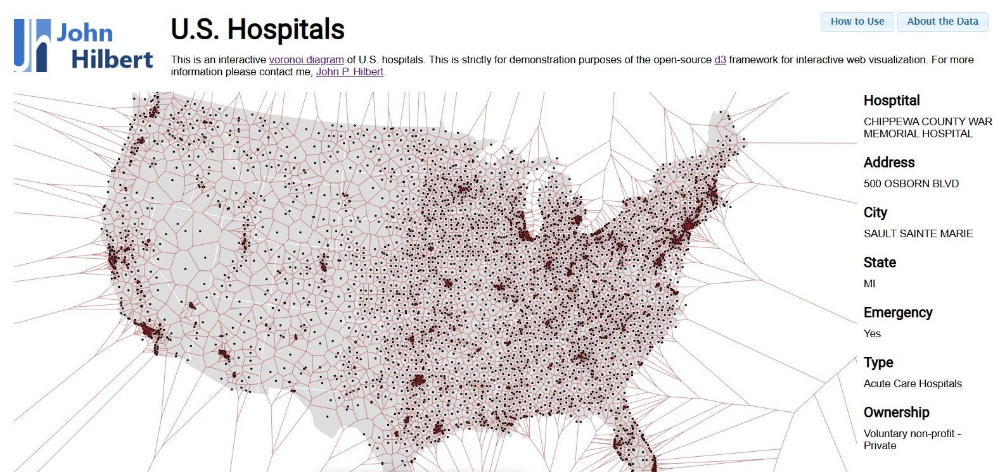

# US Hospitals Area Map
This is a proof-of-concept using D3 to make a [voronoi tessellation](https://en.wikipedia.org/wiki/Voronoi_diagram "see wikipedia") of US Hospitals.

The HTML, CSS, JavaScript, and sample data are all included here for running on your own web server **or** you can simply view a hosted version on [my site here](https://www.john-hilbert.com/projects/hospital_voroni/index.html).

In simplest terms, the chart divides the United States into regions in which every point is closest to a particular hospital. It can also be thought of as the non-overlapping area around a hospital as the radius tends to infinity as this [animation](https://en.wikipedia.org/wiki/Voronoi_diagram#/media/File:Voronoi_growth_euclidean.gif "Voronoi tessellation emerging by radial growth from points outward") demonstrates. Unfortunately this doesn't take into account roads and drive time, yet it still gives a great view of how much area a hospital is likely to service. A next step would be to overlay population and subsequently health acuity or disease burden.

## How To Use
[View on my site](https://www.john-hilbert.com/projects/hospital_voronoi/index.html)

Depending on the your window size, the map initially is centered around the Cleveland, Ohio area with parts of Michigan and Pennsylvania also visible. Panning and zooming can be done via **click-and-drag** and the **mouse wheel** respectively. **Clicking** on a region will show various information about the hospital.

## Data
The data was taken from [Data.Medicare.gov](https://data.medicare.gov/Hospital-Compare/Hospital-General-Information/v287-28n3) Due to the precision of a facility location some hospitals may not show.

## Dependencies 
* [jquery](https://jquery.com/) [2.0.3]
* [jquery UI](https://jqueryui.com/)
* [underscore](https://underscorejs.org/) [1.6.0]
* [d3.js](https://d3js.org/) [3.4.8]
* [queue.js](https://github.com/mbostock/queue) [1.0.7]
* [topojson.js](https://github.com/topojson/topojson) [1.6.12]

## :memo: TO-DO
* Toggle region highlight when clicked as with summary info
* Calculate and display area size
* Color region by hospital type (or toggle filtering of them)
* Overlay population
* Calculate population by region (see clipping of polygons to combine regions with census blocks)
* Estimate hospital size (you may know where this is leading to)
